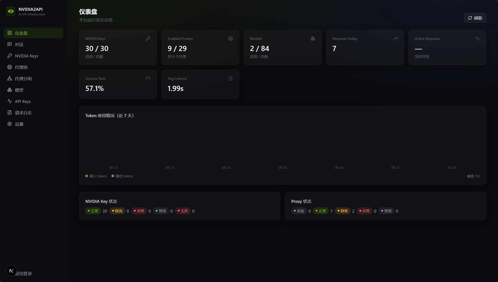

# NVIDIA2API

多渠道的 AI API 聚合中转平台：一套对外 OpenAI 兼容接口，背后可同时接入 NVIDIA、OpenCode Zen、Kilo、LLM7 等任意 OpenAI 兼容上游。每个渠道的 Key、代理池、代理分组、模型、请求日志、设置完全独立。

> **Fork 说明**：本项目源自 nvidia2api，但在原版（单一 NVIDIA 上游的聚合/竞速中转）基础上
> 持续演进，已与原版有较大差异，主要增强：**多渠道（Channel）多租户隔离**、**模型多别名 /
> 独立代理分组 / 独立端点（Responses / Anthropic 协议）**、**思考参数透传与剥离**、**渠道
> 健康检查与自动熔断**、**用户 Key Token 额度**、**敏感字段加密存储**、**健康/指标接口**等。
> 接口保持向后兼容，仍可当作纯 NVIDIA 中转使用。



## 多渠道

一个**渠道（Channel）** = 一个上游端点 + 一套独立配置。新增渠道时直接粘贴完整 chat 地址即可，系统自动拆出 base 与 path：

| 渠道           | 粘贴的地址                                              | 自动解析出的 chat\_url          |
| ------------ | -------------------------------------------------- | ------------------------- |
| OpenCode Zen | `https://opencode.ai/zen/v1/chat/completions`      | 同左                        |
| Kilo Gateway | `https://api.kilo.ai/api/gateway/chat/completions` | 同左                        |
| LLM7         | `https://api.llm7.io/v1/chat/completions`          | 同左                        |
| NVIDIA       | `https://integrate.api.nvidia.com/v1`              | `.../v1/chat/completions` |

对外调用方式：

```text
/v1/chat/completions               -> 默认渠道
/c/<slug>/v1/chat/completions      -> 指定渠道，如 /c/zen/v1/chat/completions
```

各渠道相互隔离的资源：**Keys、代理池、代理分组、模型、请求日志、运行参数**。
跨渠道共享的资源：平台对外的用户 API Key（`sk-nvidia2api-*`）。


## 功能

- 渠道管理：任意 OpenAI 兼容上游（NVIDIA / OpenCode Zen / Kilo / LLM7 …），粘贴完整 chat 地址自动解析，支持 Bearer / X-API-Key / 无鉴权，一键切换、设为默认、连通性测试

- 渠道 Keys 管理：CRUD、批量导入（`name---key` 或纯 `key`）、每渠道独立默认 RPM、服务端滑动窗口限流、429/401/5xx 自动冷却与状态管理

- 代理池：SOCKS5/HTTP/HTTPS、批量导入、分组、并发异步测速（延迟 + 公网 IP + 地理位置）；按渠道隔离，启用数量强制 `≤ 该渠道 Key 数 - 1`（后端强制，前端仅展示）

- 模型管理：按渠道同步上游模型、启停控制，仅 `enabled=true` 的模型对外暴露；同名模型可在不同渠道共存；支持**多别名**（一个模型暴露多个对外名，客户端任意一个均可调用）与**独立代理分组 / 独立端点**（Responses / Anthropic 协议）

- OpenAI 兼容 API：`/v1/*` 走默认渠道，`/c/<slug>/v1/*` 指定渠道；含 `stream=true` SSE；模型级独立端点支持 `/v1/responses` 与 Anthropic `/v1/messages` 自动转换

- 请求竞速引擎：一次请求 = 每代理 1 条线路 + 1 条直连线路，每条线路绑定不同的渠道 Key，`asyncio` 并发 + `FIRST_COMPLETED` + 响应有效性校验，首个有效响应为 Winner，其余任务立即取消

- 用户 API Key：`sk-nvidia2api-*`，仅存 SHA-256 Hash，创建时完整展示一次，支持每 Key 独立 RPM 与 **Token 额度**（跨渠道共享）

- 思考强度透传：`reasoning_effort` / `thinking` / `reasoning_budget` / `chat_template_kwargs` 等多种写法归一化后下发上游，可按模型剥离

- 请求日志：request\_id、耗时、首字、**生成速度**、Winner 线路、Key、代理、状态、Token 统计；支持**自动刷新**与筛选条件持久化；按渠道隔离

- 渠道健康：连续失败自动**熔断 + 冷却**，健康检查与运行指标接口（`/healthz`、`/metrics`）

- 安全：上游 Key / 代理密码**加密存储**（AES-GCM/Fernet，可配置独立 ENCRYPTION\_KEY），日志不落完整密钥

- Dashboard：Key/Proxy/Model/请求量/成功率/平均延迟统计；跟随当前渠道

- 内置对话页：直接通过竞速引擎在线测试已启用模型（流式 + 思考展示 + Token 统计）

- 设置：运行参数按渠道独立保存，可一键恢复默认

- 管理后台登录：`/api/admin/login`（用户名密码 → 固定 Token）

## 技术栈

- 后端：Python 3.12+、Django 6、DRF、SQLite、httpx（含 httpx\[socks]/httpx-socks）、asyncio

- 前端：Next.js 16、TypeScript、Tailwind CSS、lucide-react

## 结构

```
backend/     Django（config/ 配置、apps/core/ 数据模型、services/ 业务服务、api/ Admin + OpenAI API、tests/ 测试）
frontend/    Next.js 控制台（dashboard、channels、chat、keys、proxies、proxy-groups、models、api-keys、request-logs、settings、login）
data/        SQLite 数据目录（Docker 卷挂载点）
```

## 快速开始

```bash
cp .env.example .env

# 后端
cd backend
pip install -r requirements.txt -r requirements-dev.txt   # 运行时与测试依赖已分离
python manage.py migrate
python -m pytest tests          # 515 个测试：导入/限流/代理限制/竞速/并发安全/思考强度/多渠道/额度/熔断/回归守卫/前端静态托管/心跳探测/R4 性能/R5 宽松判胜守卫/R10 上游错误详情/单进程契约/错误信封/敏感操作审计
python manage.py runserver 0.0.0.0:8000

# 前端
cd frontend
npm install
npm run dev                     # http://localhost:3000
npm run typecheck               # 类型检查（Next 16 已移除 next lint，故 lint 指向 tsc）
```

管理员凭据来自 `.env` 的 `ADMIN_USERNAME/ADMIN_PASSWORD/ADMIN_TOKEN`。
**出厂默认值** **`admin123`** **/** **`dev-admin-token`** **在** **`DEBUG=false`** **下会直接拒绝启动**，
请先改成随机值（`.env.example` 里有生成命令）；`ADMIN_TOKEN` 支持逗号分隔多值以便无缝轮换。

## Docker

```bash
cp .env.example .env
# 把 ADMIN_PASSWORD / ADMIN_TOKEN 改成随机值（DEBUG=false 下拒绝使用出厂默认值）
docker compose up -d
```

单容器同时提供 API 与控制台（Next.js 静态导出产物打包进 `/app/static/frontend`，
由 Django 在同一 8000 端口托管）：控制台为 `http://localhost:8000/`。

SQLite 数据保存在 `./data`（已挂载到容器 `/app/data`）。

## 使用流程

1. 登录控制台 → **渠道** → 新增渠道（内置 OpenCode Zen / Kilo / LLM7 预设，也可直接粘贴自己的端点），用顶部下拉一键切换当前渠道
2. **渠道 Keys** → 批量导入该渠道的 Key（`主账号01---sk-xxx` 或每行一个 `sk-xxx`，自动去重/自动命名）
3. **Proxies** → 批量导入代理、测速、获取 IP、启用（数量受该渠道 Key 数 - 1 限制）
4. **Models** → 点击「同步渠道模型」，启用要暴露的模型
5. **API Keys** → 创建用户 Key（完整 Key 仅显示一次，跨渠道通用）
6. 用 OpenAI SDK 调用：

```python
from openai import OpenAI

# 默认渠道
client = OpenAI(api_key="sk-nvidia2api-xxxx", base_url="http://localhost:8000/v1")

# 指定渠道：base_url 加 /c/<slug> 前缀
zen = OpenAI(api_key="sk-nvidia2api-xxxx", base_url="http://localhost:8000/c/zen/v1")

resp = zen.chat.completions.create(
    model="your-model-id",
    messages=[{"role": "user", "content": "你好"}],
    extra_body={"reasoning_effort": "high"},   # 思考强度会归一化后下发上游
)
print(resp.choices[0].message.content)
```

## 竞速机制

```
用户 → 解析渠道 → 验证 Key/模型/限流 → build_routes(channel)
  代理A + Key1 ┐
  代理B + Key2 ├ asyncio 并发 (FIRST_COMPLETED)
  直连  + Key3 ┘
        ↓
  是有效的 AI Protocol 响应才判定 Winner → 取消其余任务 → 返回用户
```

- `is_valid_response`：HTTP 200 + 有 choices + 有 message/delta 且无 error 字段

- 429 → Key 标记 rate\_limited + 60s 冷却；401/403 → invalid；单代理/单 Key 故障不影响整体请求

- 流式：首条有效 SSE chunk 到达即判定 Winner，随后转发剩余 chunk，其余线路取消

## 并发说明

Key 的 RPM 计数使用 SQLite 条件更新（`UPDATE ... WHERE count < rpm_limit`）保证原子性，多线程下不会超限；项目预留了迁移 PostgreSQL/Redis 的结构空间。

### ⚠️ 单进程契约（部署前必读）

**本服务必须单进程运行**：不要 `uvicorn --workers N`，不要让多个容器实例挂同一个 `data/` 卷。

原因不是"性能没优化"，而是**所有限流与保护状态都是进程内的**，多进程下它们不报错、只是静默失效：

| 状态 | 多进程后果 |
|---|---|
| `max_concurrent_requests` 全局闸门 | 上限被乘以进程数 |
| `max_concurrent_upstream` 上游连接阀门 | 同上，连接数保护消失 |
| 管理端登录失败限速 | 爆破防护被稀释 |
| `sysconfig` / `model_registry` 读缓存 | 写路径的信号失效只作用于本进程，跨进程最长陈旧 = TTL 3s |

因此启动阶段会拿 `data/.gateway.lock` 的 OS 级文件锁做单实例检查，检测到第二个实例直接**拒绝启动**并在错误里给出持有者 PID。确需多进程（例如已把上述状态外置）时设置 `ALLOW_MULTI_PROCESS=true` 显式放行——后果自负，启动时会打一条警告日志。

水平扩展的正确路径是：先把并发闸门与缓存搬到 Redis、SQLite 换 PostgreSQL，再谈多实例。

## 环境变量

见 `.env.example`。

## 文档

详见 [docs/](docs)：架构、数据库、后端模块、竞速引擎、Admin API、OpenAI API、前端、部署。
